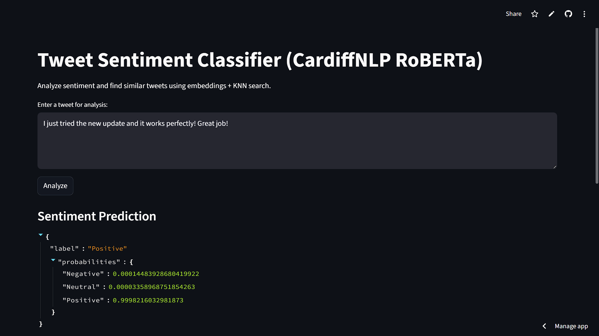
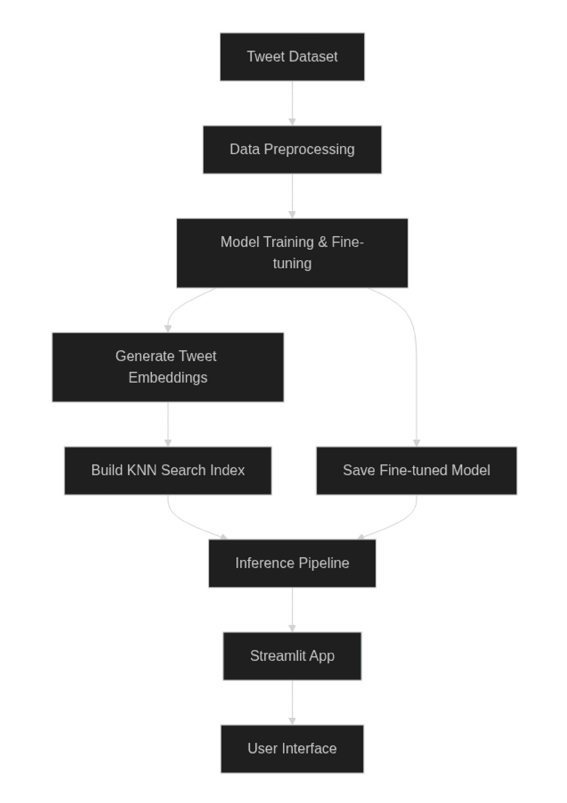

# Tweet Sentiment Classifier — Rizqi Fajar  
Fine-tuned Tweet Sentiment Classification using Hugging Face + Streamlit

<p align="left">
  
  
  
  
  
</p>

---

## 🔗 Live Demo

You can try the deployed Streamlit application here:  
👉 **https://rf-tweet-sentiment-classifier.streamlit.app/**

Below is a preview screenshot showing the interface and prediction result:

<p align="center">
  
</p>
<p align="center">
  
</p>

---

## 📦 Dataset  

This project uses the **Twitter Airline Sentiment Dataset** from Kaggle, created by Chandana:  
https://www.kaggle.com/datasets/chandana890/twitter-airline-sentiment-dataset/data

The dataset contains approximately **59,899 tweets** (rounded to **~60,000 tweets**) collected from Twitter/X, each labeled with one of three sentiment categories:

- **Positive**  
- **Neutral**  
- **Negative**

These tweets represent real customer experiences with airlines, making the dataset highly suitable for training sentiment models on short, informal, and noisy social media text.

The dataset is divided into three subsets and stored in parquet format inside the `dataset/` directory:

- **Training set**  
- **Validation set**  
- **Test set**


---

## 🧠 Model  
### **`cardiffnlp/twitter-roberta-base-sentiment-latest`**  
🔗 https://huggingface.co/cardiffnlp/twitter-roberta-base-sentiment-latest

#### Model Details
- **Architecture:** RoBERTa-base  
- **Pretrained on:** 124M Twitter posts  
- **Task:** Sentiment Classification  
- **Labels:**  
  - `0` → Negative  
  - `1` → Neutral  
  - `2` → Positive  

**Why this model?**  
✔ State-of-the-art for tweet/X sentiment  
✔ Strong on informal/noisy text  
✔ Fast enough for real-time Streamlit inference  

---

## 🧩 KNN Search & Embeddings (Custom Enhancements)

This project includes a **hybrid transformer + vector similarity pipeline**:

### 🔹 Embeddings (`embeddings.py`)
- Extracts dense sentence embeddings  
- Saves vectors → `train_embedding.npy`  
- Used for similarity search & interpretability  

### 🔹 KNN Index (`knn_search.py`)
- Builds FAISS-like KNN index → `knn_index.pkl`  
- Enables:
  - Nearest tweet lookup  
  - Similarity-based analysis  
  - Context-aware support for predictions  

### 🔹 Inference Pipeline (`inference.py`)
Includes:
- Preprocessing  
- RoBERTa forward pass  
- Optional KNN-based scoring  
- Unified prediction interface  

Result:
> Transformer-based sentiment classification + embedding-level retrieval.


## 🔄 End-to-End Pipeline Flowchart

This project includes a complete end-to-end pipeline for sentiment classification, combining preprocessing, transformer inference, and optional KNN-based similarity search.

<p align="center">
  
</p>

### Flowchart Overview

---

## 📁 Repository Structure  

```
nolimit-ds-test--Rizqi-Fajar-/
│
├── src/
│   ├── __pycache__/
│   ├── config.py
│   ├── dataset.py
│   ├── preprocessing.py
│   ├── embeddings.py
│   ├── knn_search.py
│   ├── inference.py
│   └── utils.py
│
├── trained_model/
│   ├── config.json
│   ├── knn_index.pkl
│   ├── merges.txt
│   ├── model.safetensors
│   ├── special_tokens_maps.json
│   ├── tokenizer.json
│   ├── tokenizer_config.json
│   ├── train_embedding.npy
│   └── vocab.json
│
├── dataset/
│   ├── small_sample.json
│   ├── test-00000-of-00001.parquet
│   ├── train-00000-of-00001.parquet
│   └── validation-00000-of-00001.parquet
│
├── artifacts/
│   ├── evaluate_model.py
│   └── model_training.py
│
├── .gitattributes
├── requirements.txt
├── README.md
├── demo1.png
├── demo2.png
├── pipeline.png
├── streamlit_app.py
└── train.ipynb
```

---

## ⚙️ Installation  

### 1. Clone the repo
```bash
git clone https://github.com/Rxseboy/nolimit-ds-test--Rizqi-Fajar-.git
cd nolimit-ds-test--Rizqi-Fajar-
```

### 2. Create virtual environment (optional)
```bash
python -m venv venv
source venv/bin/activate      # macOS / Linux
venv\Scripts\activate         # Windows
```

### 3. Install dependencies
```bash
pip install --upgrade pip
pip install -r requirements.txt
```

---

## ▶️ Run Streamlit App
```bash
streamlit run streamlit_app.py
```
→ App opens on:  
http://localhost:8501  

---

## 🤖 Python Inference Example

```python
from transformers import AutoTokenizer, AutoModelForSequenceClassification, pipeline

model_id = "cardiffnlp/twitter-roberta-base-sentiment-latest"

tokenizer = AutoTokenizer.from_pretrained(model_id)
model = AutoModelForSequenceClassification.from_pretrained(model_id)

classifier = pipeline("sentiment-analysis", model=model, tokenizer=tokenizer)

text = "I really love this project!"
print(classifier(text))
```

Example Output:
```json
{
  "label": "Positive",
  "probabilities": {
    "Negative": 0.0001887,
    "Neutral": 0.0000410,
    "Positive": 0.9997702
  }
}
```

---

## 🔍 Example Predictions

| Input | Output |
|-------|--------|
| “The flight was terrible and delayed for hours.” | Negative |
| “It was okay, nothing special.” | Neutral |
| “Amazing service! Will fly again!” | Positive |

---

## ❗ Troubleshooting

### 🔹 Streamlit Not Opening
- Ensure port **8501** is not used  
- Activate virtual environment  

### 🔹 Model Not Downloading
```bash
pip install --upgrade huggingface_hub
```

### 🔹 CUDA Issues
- Install PyTorch matching your CUDA version  
- Or run on CPU (works fine for inference)

---

## 👤 Author  
**Rizqi Fajar**

---

## 📬 Contact  

For further questions or inquiries, feel free to reach out:

**RIZQI FAJAR**

📧 **Email:**  
<a href="mailto:rizqyfajar777@gmail.com">
  
</a>

🌐 **Social Profiles:**  
<a href="https://instagram.com/_rizqifajar_" target="_blank">
  
</a>


---
